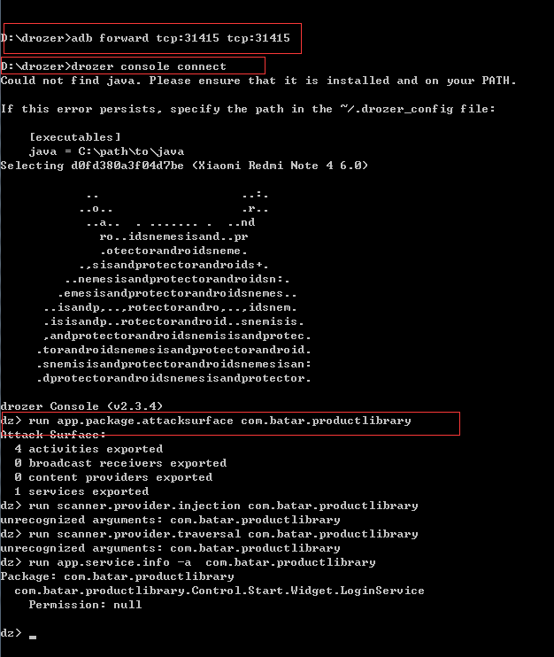
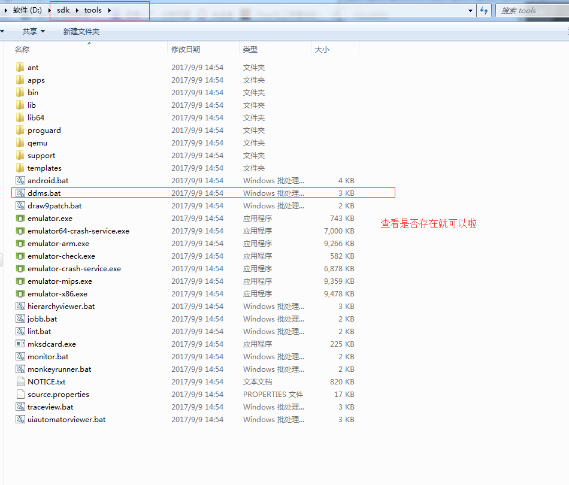

=========================== 
检测工具
=========================== 

基础环境
----------

* 安装java、python、SDK、adb等环境，并且配置好环境变量
* 安装一个可视化数据库用来查看数据库表

Burpsuite安装
---------------
* 用于攻击web应用程序的集成平台，可以暴力破解、重放攻击、绕过验证等。

* 只要安装了Java，并配置好环境就可以直接打开了

.. image:: media/Burpsuite.png
        :align: center
        :alt: android-device-list

Androidkiller
---------------
* 是一款可视化的安卓应用逆向工具，集apk反编译、apk打包、apk签名，编码互转，ADB通信（应用安装-卸载-运行-设备文件管理）等特色功能于一身。

* 直接打开点exe文件就可以了。 

.. image:: media/Androidkiller.png
      :align: center
      :alt: android-device-list

Drozer（龙刀）
---------------

* 是一款综合的安全评估和攻击的android框架。
* 安装
    * 从http://mwr.to/drozer下载Drozer (Windows Installer)。

    * 在Android设备中安装agent.apk。
    .. code-block:: shell

        adb install agent.apk。
* 启动

    * 在PC上使用adb进行端口转发，转发到Drozer使用的端口31415。
    .. code-block:: shell

        adb forward tcp:31415 tcp:31415。

    * 在Android设备上开启Drozer Agent，选择embedded server-enable（点击“开启”）。

    * 在PC上开启Drozer console。  
    .. code-block:: shell

      drozer console connect。

* 开始测试

    * 确定攻击面 
    .. code-block:: shell

        run app.package.attacksurface + 包名。

    * 获取activity/Content Provider/broadcast/service信息。命令：run app.activity.info -a  + 包名。

    注：详细请看：http://www.cnblogs.com/goodhacker/p/3906180.html 利用drozer进行Android渗透测试。

DDMS
---------------
* DDMS（Dalvik Debug Monitor Service），是 Android 开发环境中的Dalvik虚拟机调试监控服务。
 
* 主要安装了SDK，就自带这个工具。

IDA Pro
---------------
* 是目前最棒的一个静态反编译软件，为众多0day世界的成员和ShellCode安全分析人士不可缺少的利器！
    
* 安装：下载安装地址：https://www.52pojie.cn/thread-366098-1-1.html  按照上面下载安装就好了。

.. toctree::
   :titlesonly: