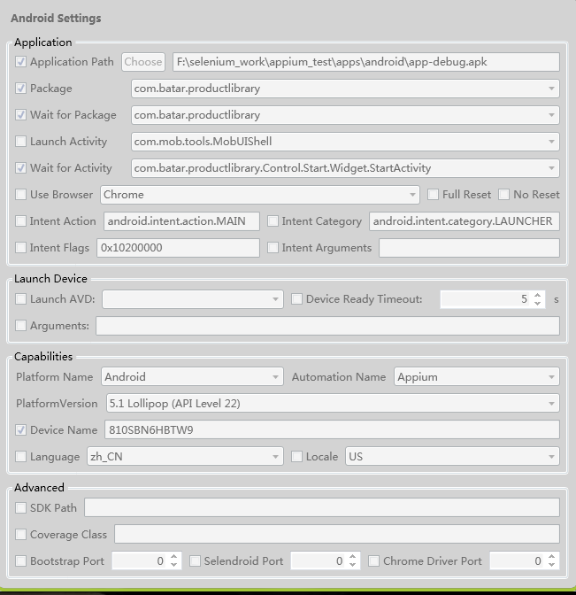
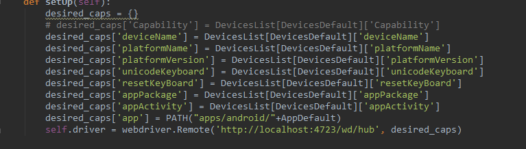

=========================== 
Android Appium 使用
=========================== 

* PC运行Appium
	* appium采用方法二(exe文件安装)，直接双击桌面图标Appium或者点击windows桌面左下角图标进入所有程序中找
	* appium采用方法一，cmd下appium &    
* 执行python脚本（python test.py）
* 在appium程序界面查看日志

Appium配置
--------------

* 方法一：通过appium的界面配置参数（参数固定）

* 方法二：代码中配置能适用不同机器 
.. image:: media/appium_setting_2.png
	    :align: center
	    :alt: 配置界面

