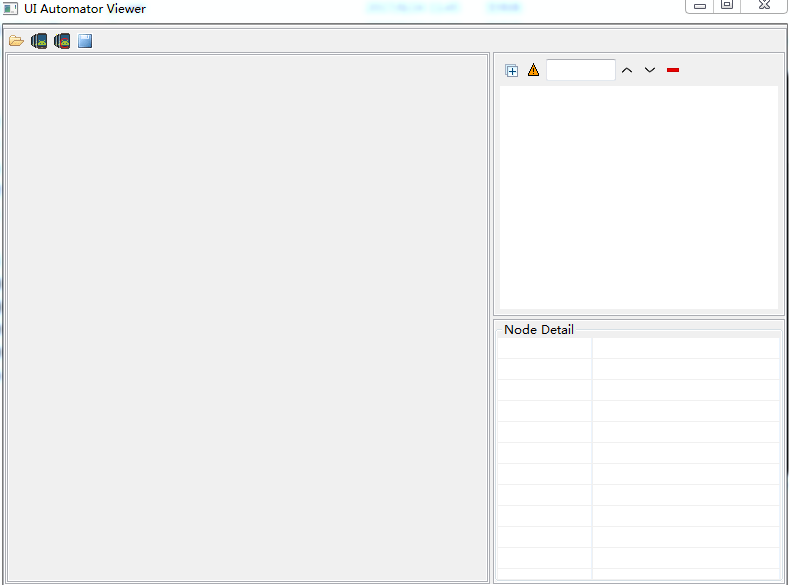
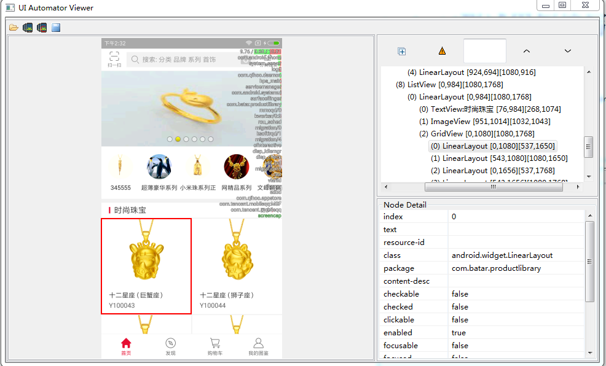

=========================== 
Android测试用例编写
=========================== 

uiautomatorviewer使用
-------------------------

在(sdk安装路径下的tools中)D:\\Program Files (x86)\\Android\\android-sdk\\tools路径下双击uiautomatorviewer.bat

启动后的界面如下

点击左上角的手机图标(两个均可。区别暂未关注)，即可看到手机当前屏幕，可以根据右边的信息定位元素

