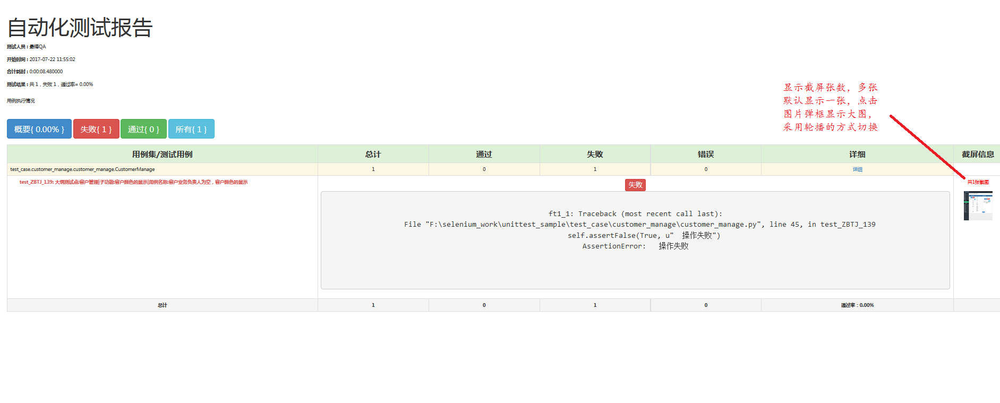
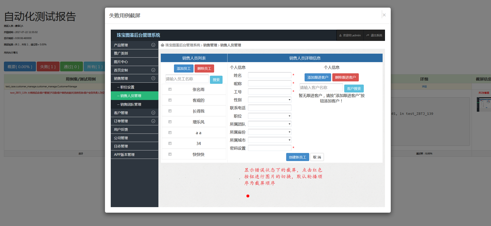

=========================== 
工程使用
=========================== 

工程默认结构如图所示
--------------------
.. image:: media/project_tree.png
    :align: center
    :alt: 工程目录结构

生成测试用例
------------
* 生成测试用例，执行下面的命令：
    .. code-block:: shell

	   python gen_test_case_by_excel.py 珠宝图鉴V1.4版本测试用例.xlsx  [0,2,4]

	其中第三个参数为可添加参数，若无默认为excel文件中的第一个sheet,多个sheet采用,进行分割
* 命令执行完成后，生成的工程结构如下图
.. image:: media/all_tree.png
    :align: center
    :alt: 工程目录结构
* 运行测试用例，若工程中所有的测试用例都处于注销状态（所有用例的修饰符@unittest.skip("sample")都未被注销），下面的命令将会报错
.. code-block:: shell

	python test_main.py

	等待测试结果，并查看测试报告

报告查看
--------
* 整体报告，具体内容见下图

* bug截屏

