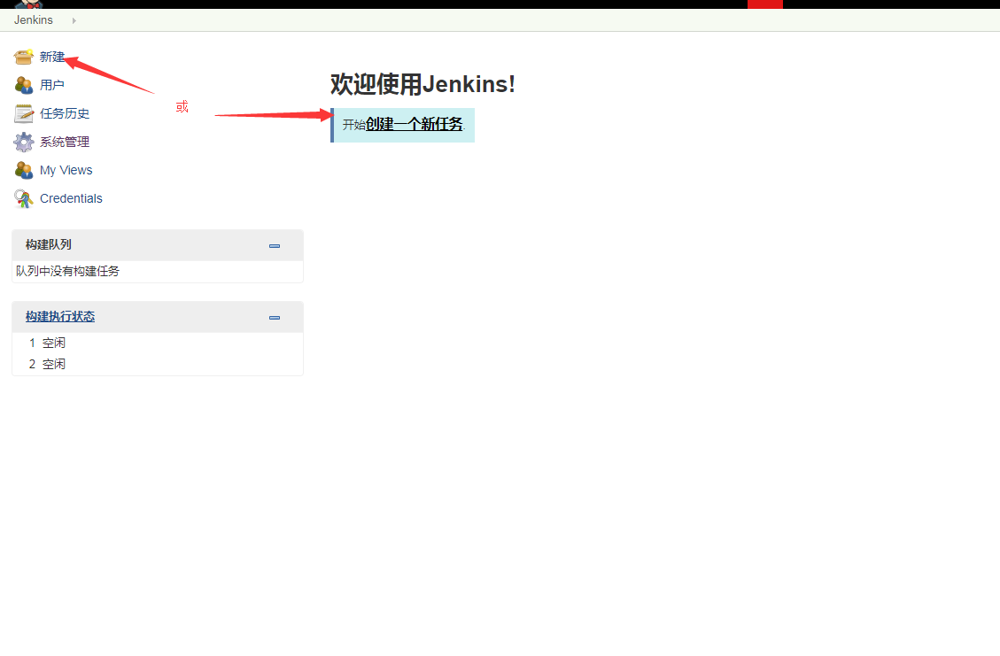
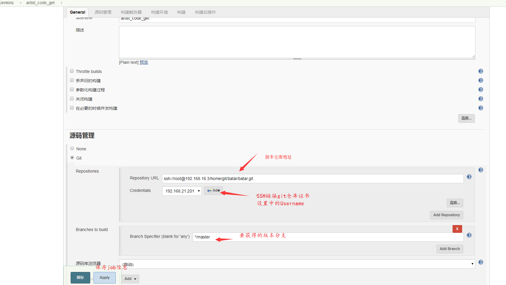

=========================== 
代码获得(job)
=========================== 

新建任务(自由风格项目):artist_code_get
------------------------

任务创建
---------

.. image:: media/job_create.png
    :align: center
    :alt: 任务创建

任务信息
---------

手动开启任务
--------------

.. image:: media/code_get_job_start.png
    :align: center
    :alt: 任务信息

查看任务结果信息
-----------------

.. image:: media/code_get_job_result_info.png
    :align: center
    :alt: 任务信息

定时构建
---------
晚上12点

.. image:: media/artist_code_get_job_auto.png
    :align: center
    :alt: 定时构建

