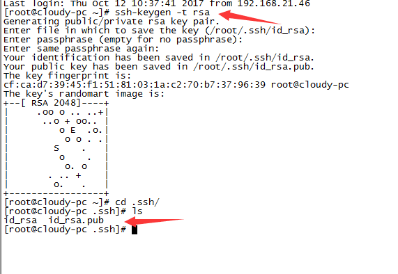
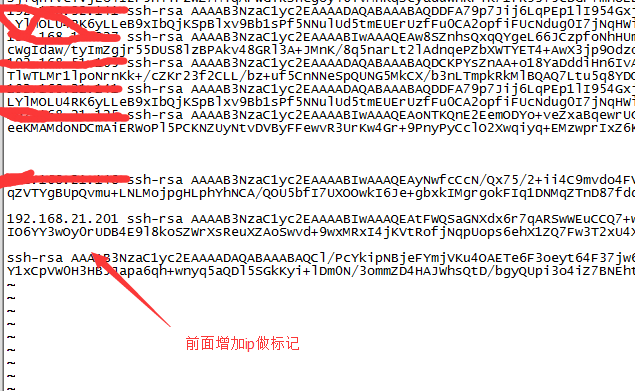

====================
Linux SSH Key 生成
====================

执行下面的命令
--------------

ssh-keygen -t rsa  

默认回车即可

将根目录下.ssh/id_rsa.pub 的内容放到仓库服务器下用户的(本手册采用的是root用户)根目录.ssh/known_hosts中

id_rsa中的内容在 SSH链接git仓库证书设置中使用 Private Key
