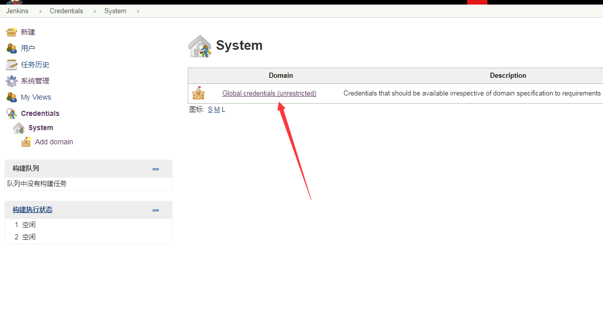
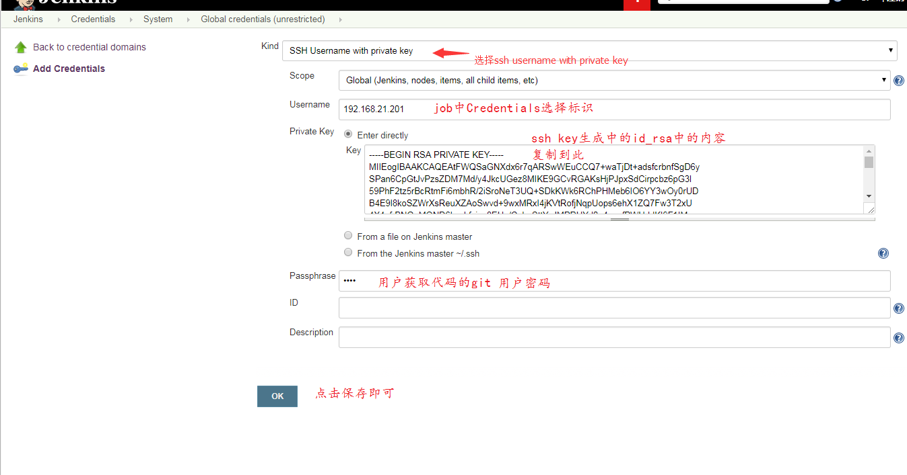

=============================
SSH链接git仓库证书设置
============================= 

证书创建
----------

步骤：
-----
.. image:: media/Credentials_click.png
    :align: center
    :alt: 任务创建

.. image:: media/Credentials_system_1.png
    :align: center
    :alt: 任务创建    

.. image:: media/Credentials_click_add.png
    :align: center
    :alt: 任务创建       

用户信息
---------

