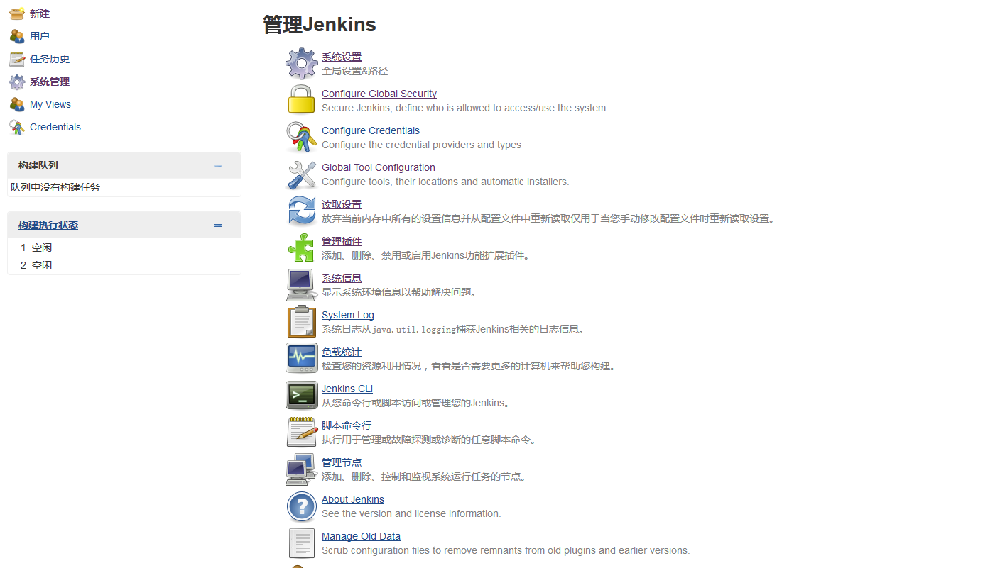
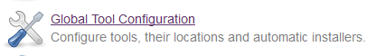
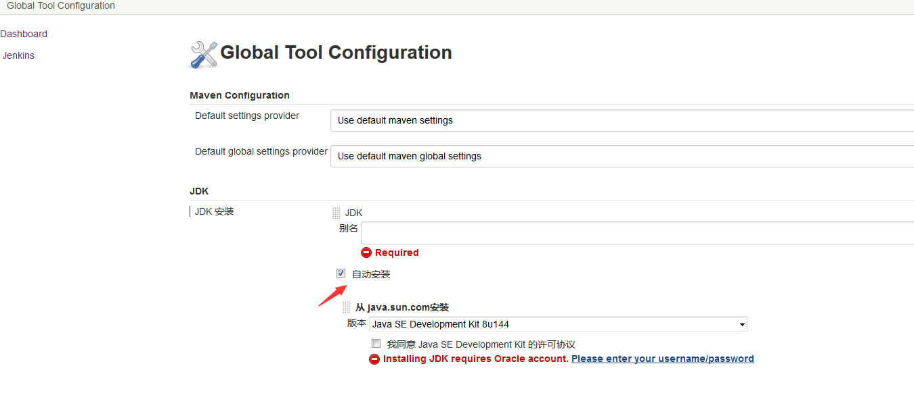

=========================== 
Jenkins设置
=========================== 

系统配置页面
-------------

配置jdk
-------
点击系统配置页面的 

进入页面后，点击 新增JDK

.. image:: media/jdk_setting.png
    :align: center
    :alt: JDK配置页面

maven设置(建议手动安装)
---------
	自动安装在第一次使用的时候会下载，手动安装参考jdk配置，其他配置类似

 .. image:: media/maven_config.png
    :align: center
    :alt: maven配置页面
     

设置ssh时 需要填写git仓库服务器用户的登录密码  在Passphrase中