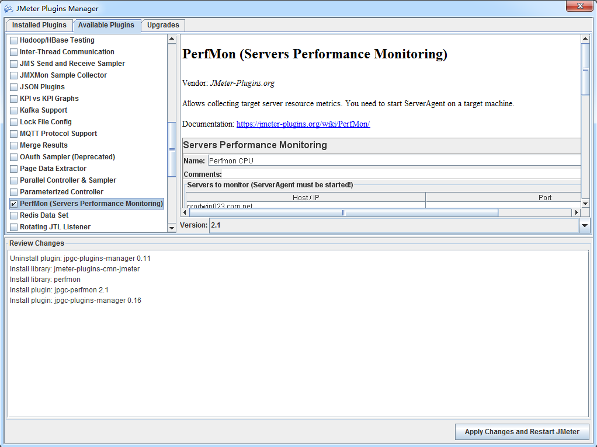

===================
服务器性能监控插件
===================

添加插件
---------

服务器端脚本
------------

* 脚本介绍：https://jmeter-plugins.org/wiki/PerfMonAgent/
* 下载地址：https://jmeter-plugins.org/files/ServerAgent-2.2.1.zip
* 将其放到目标服务器上，解压后进入目录，执行下面的命令
	.. code-block:: java

		./startAgent.sh --udp-port 0 --tcp-port 3450
	不指定参数是默认端口为4444

JMeter Properties
------------------
* jmeterPlugin.perfmon.useUDP - true/false, enabling UDP connection try after failed TCP connection attempt
* jmeterPlugin.perfmon.label.useHostname - true/false, enable using "short" hostnames, default pattern is ([\w\-]+)\..*
* jmeterPlugin.perfmon.label.useHostname.pattern - string (escaped), regular expression to extract hostname (first group is matched)
	* e.g. Default pattern would be: jmeterPlugin.perfmon.label.useHostname.pattern=([\w\-]+)\..*
	* e.g. Pattern for EC2 us-east/west subdomain matching: jmeterPlugin.perfmon.label.useHostname.pattern=([\w\-]+\.us-(east|west)-[0-9]).*
* forcePerfmonFile - true/false, enabling it makes JMeter to write JTL file with perfmon metrics in the current directory